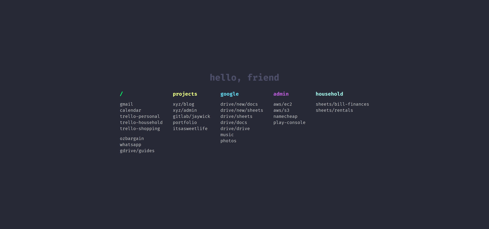

## Preview

## Releases

- Firefox: https://addons.mozilla.org/en-US/firefox/addon/hello-friend-new-tab/
- Chrome: https://chrome.google.com/webstore/detail/hello-friend/aehibelbdjcoffckialjmnilfimajain

## Notes

- In Firefox you'll have to manually set the home page.
    - Check the console for the URL in a new hello-friend tab
- In Chrome remove the `applications` object in the `manifest.json` this is Firefox only

## Roadmap / Contributions

See https://github.com/jaywick/hello-friend/issues

## Local development

Clone the source

    git clone git@github.com:jaywick/hello-friend.git

Firefox

1. Go to `about:debugging` in address bar
2. Click _Load Temporary Add-on_ button on top right
3. Open any file at root directory of this extension's source

Chrome

1. Go to `chrome://extensions/` in address bar
2. Tick _Developer mode_ toggle at top right
3. Click _Load Unpacked_
4. Choose the directory of this extenson's source code
